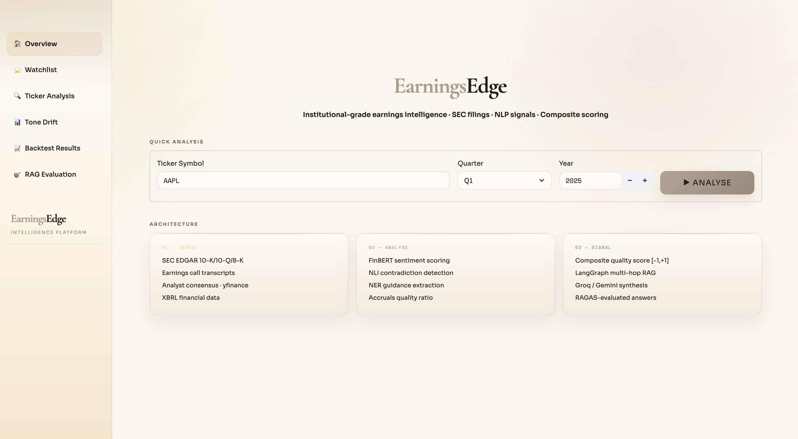
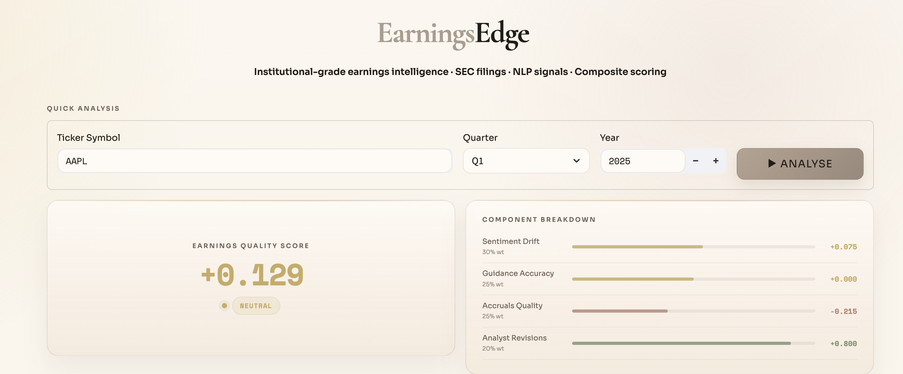
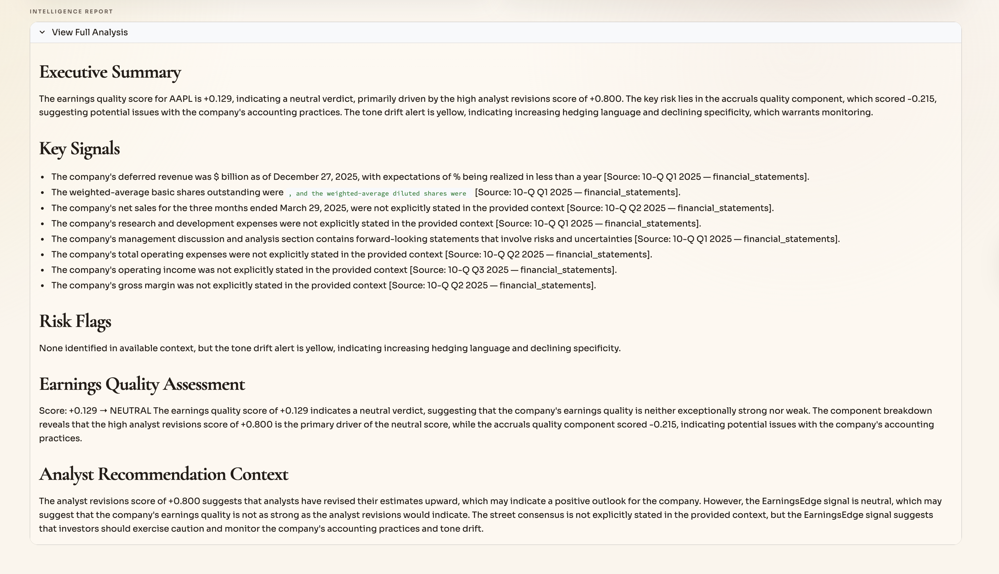
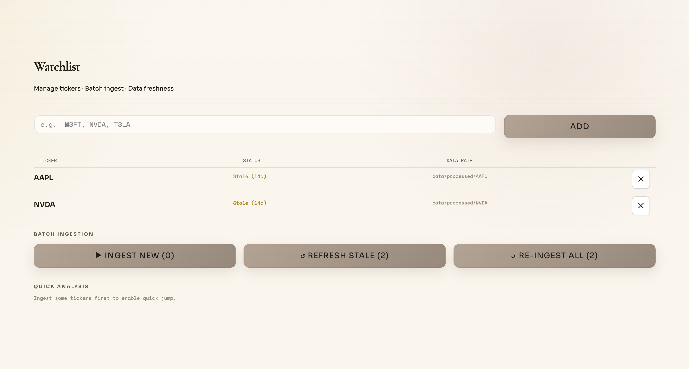
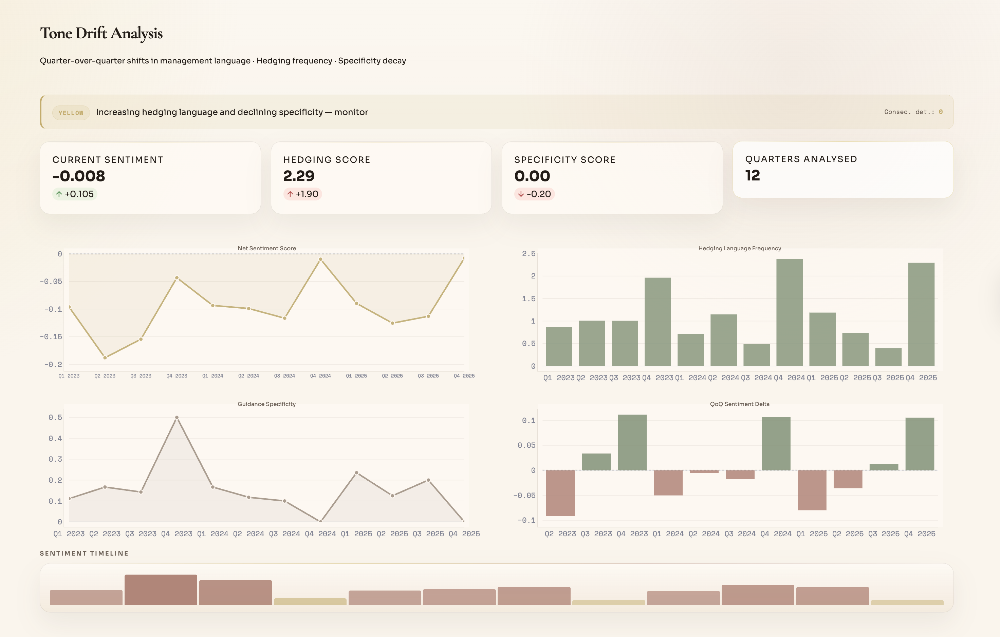
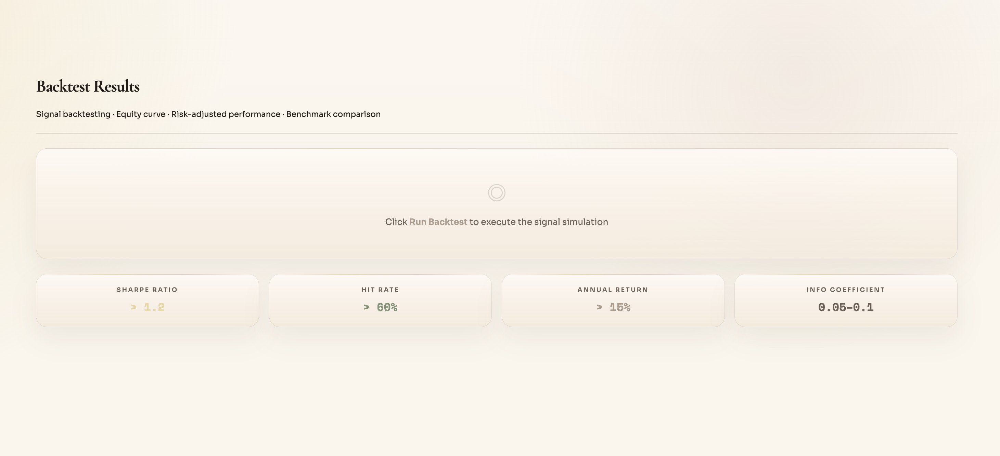

<div align="center">


# EarningsEdge

**Institutional-grade earnings intelligence. No Bloomberg terminal required.**

<br>

[](https://python.org)
[](https://github.com/langchain-ai/langgraph)
[](https://huggingface.co/ProsusAI/finbert)
[](https://www.trychroma.com)
[](https://groq.com)
[](https://streamlit.io)
[](LICENSE)

> *"Alpha is in the language before it's in the numbers."*

</div>

---

## What Is EarningsEdge?

EarningsEdge is a **production-grade, end-to-end earnings intelligence platform** that processes SEC filings the same way a quant research desk does — except it runs on your laptop, costs nothing, and synthesizes insights in seconds.

It reads **10-K, 10-Q, and 8-K filings** directly from SEC EDGAR, extracts financial signals from management language using NLP, detects when executives contradict themselves across quarters, measures the gap between stated guidance and reported actuals, computes a **forensic accruals ratio** from XBRL data, and rolls everything into a single composite quality score — then answers analyst-style questions about any US-listed company using a **multi-hop LangGraph RAG pipeline**.

**No terminal commands per ticker. Type a symbol. Click Analyse. Get alpha.**

---

## 📸 Screenshots

### 🏠 Home — Quick Analysis


*Type any US-listed ticker and hit Analyse. The full pipeline — SEC fetch, embedding, NLP analysis, RAG synthesis — runs automatically in the UI.*

---

### 📊 Ticker Analysis — Earnings Quality Score


*Composite quality score [-1, +1] with 4-component breakdown. GREEN / YELLOW / RED tone drift alert alongside retrieval metadata.*

---

### 🔍 NLI Contradiction Detection


*DeBERTa-v3 cross-encoder flags semantic contradictions between quarters — e.g., "robust supply chain" in Q2 vs. "supply chain headwinds" in Q3.*

---

### 📈 Intelligence Report


*Full LLM-synthesised analyst report with source citations — ticker, quarter, year, and section — grounded in retrieved SEC filing context.*

---

### ⭐ Watchlist & Batch Ingestion


*Add multiple tickers at once. Batch ingest new, refresh stale (>7 days), or re-ingest all — with per-ticker live status and a progress bar.*

---

### 📉 Tone Drift Monitor


*Quarter-by-quarter FinBERT sentiment timeline. Consecutive deterioration triggers RED alert — management credibility signal before consensus cuts.*

---

### 🔁 Backtest Results


*Composite score → long/short signal → returns. Sharpe ratio, hit rate, information coefficient (IC), alpha, and beta vs. SPY.*

---

## The Signal Engine — How the Score is Built

```
╔══════════════════════════════════════════════════════════════════════╗
║           EarningsQualityScore  ∈  [−1.0, +1.0]                    ║
╠══════════════════════════════════════════════════════════════════════╣
║                                                                      ║
║   0.30 × Sentiment Drift          (FinBERT · tone across quarters)  ║
║   0.25 × Guidance Accuracy        (stated vs. reported actuals)     ║
║   0.25 × Accruals Quality         ((NI − OCF) / Total Assets)       ║
║   0.20 × Analyst Revisions        (consensus direction · yfinance)  ║
║                                                                      ║
║   Score > +0.30  →  ▲  LONG                                         ║
║   Score < −0.30  →  ▼  SHORT                                        ║
║   Otherwise      →  —  NEUTRAL                                      ║
╚══════════════════════════════════════════════════════════════════════╝
```

### Why These Factors?

| Factor | The Finance Behind It |
|---|---|
| **Sentiment Drift** | Management tone deteriorates before guidance cuts. FinBERT trained on financial filings detects this 1–2 quarters early. |
| **Guidance Accuracy** | Sandbagging (conservative guidance) predicts positive surprises. Overoptimistic guidance predicts misses. |
| **Accruals Ratio** | Sloan (1996): high accruals mean earnings aren't backed by cash. The anomaly generates ~10% annual alpha in long/short portfolios. |
| **Analyst Revisions** | Net revision direction is a proxy for informed money flow. Upgrades before earnings = smart money positioning. |

---

## Architecture

```
                     ┌──────────────────────────────────────────┐
                     │            DATA INGESTION                │
  SEC EDGAR ─────────┤  10-K · 10-Q · 8-K  (XBRL + full text)  │
  Earnings Calls ────┤  Prepared remarks · Q&A segmentation     │
  Analyst Consensus ─┤  yfinance · price targets · revisions    │
                     └────────────────┬─────────────────────────┘
                                      │
                     ┌────────────────▼─────────────────────────┐
                     │          PROCESSING PIPELINE             │
                     │  Parser → 4-strategy Chunker             │
                     │  MetadataTagger (section, ticker, date)  │
                     │  BGE-large-en-v1.5 → ChromaDB            │
                     └────────────────┬─────────────────────────┘
                                      │
         ┌────────────────────────────▼─────────────────────────────────┐
         │                   SIGNAL EXTRACTION                          │
         │  FinBERT Sentiment  ·  Tone Drift Detector (G/Y/R alert)     │
         │  DeBERTa NLI Contradiction Detection (cross-quarter)         │
         │  spaCy NER — EPS · Revenue · CapEx · Margin guidance         │
         │  XBRL Accruals Ratio  (Net Income − OCF) / Total Assets      │
         └────────────────────────────┬─────────────────────────────────┘
                                      │
         ┌────────────────────────────▼─────────────────────────────────┐
         │             LANGGRAPH RAG PIPELINE  (9 nodes)                │
         │                                                              │
         │  retrieve_context → gap_detector ──► expand_context         │
         │        │                                  │                  │
         │        ▼                                  ▼                  │
         │  sentiment_node → quality_check ──► synthesize              │
         │        │                                  │                  │
         │        ▼                                  ▼                  │
         │  format_output ────────► RAGAS evaluate → MLflow log        │
         └────────────────────────────┬─────────────────────────────────┘
                                      │
                     ┌────────────────▼─────────────────────────┐
                     │       GROQ / GEMINI LLM SYNTHESIS        │
                     │  llama-3.3-70b  (primary)                │
                     │  Gemini 1.5 Flash  (auto-failover)       │
                     │  Source-cited · RAGAS-evaluated          │
                     └────────────────┬─────────────────────────┘
                                      │
                     ┌────────────────▼─────────────────────────┐
                     │          STREAMLIT DASHBOARD             │
                     │  Auto-ingest · Watchlist · Backtest      │
                     └──────────────────────────────────────────┘
```

---

## Tech Stack

| Layer | Technology | Why |
|---|---|---|
| **LLM Primary** | Groq `llama-3.3-70b-versatile` | Sub-second inference, free tier |
| **LLM Fallback** | Google Gemini 1.5 Flash | Auto-switches on rate limit |
| **Embeddings** | `BAAI/bge-large-en-v1.5` | MTEB top-tier, 768-dim, financial text |
| **Sentiment NLP** | `ProsusAI/finbert` | Fine-tuned on 10-K/10-Q language |
| **Contradiction** | `cross-encoder/nli-deberta-v3-base` | NLI scoring for cross-quarter consistency |
| **NER** | spaCy `en_core_web_trf` + regex rules | Guidance extraction (EPS, revenue, capex) |
| **Orchestration** | LangGraph (9-node state machine) | Multi-hop retrieval with conditional routing |
| **Vector Store** | ChromaDB (local persistent) | Rich metadata filtering by section, quarter |
| **Validation** | Pydantic v2 (21 models) | Typed pipeline, zero unvalidated dicts |
| **Market Data** | yfinance | Price history, analyst consensus, revisions |
| **Backtesting** | vectorbt + pandas | Sharpe, IC, alpha, beta, hit rate |
| **RAG Evaluation** | RAGAS | Faithfulness, relevancy, context recall |
| **Experiment Tracking** | MLflow | Latency, grounding score, retrieval metrics |
| **Dashboard** | Streamlit + Plotly | Zero-click ingestion, live progress display |
| **Package Manager** | uv | 10–100× faster than pip |

---

## Quickstart

### Prerequisites
- Python 3.11+
- [uv](https://docs.astral.sh/uv/getting-started/installation/) — `curl -LsSf https://astral.sh/uv/install.sh | sh`

### 1. Clone & Install

```bash
git clone https://github.com/aryadoshii/EarningsEdge.git
cd EarningsEdge
make setup
```

### 2. Configure API Keys

```bash
cp config/.env.example .env
```

Edit `.env` — all free tier:

```env
GROQ_API_KEY=your_key_here        # console.groq.com
GOOGLE_API_KEY=your_key_here      # aistudio.google.com
SEC_USER_AGENT=Name email@domain  # required by SEC fair-use policy
```

### 3. Launch

```bash
make run
# → http://localhost:8501
```

**That's it.** Type any US-listed ticker, click Analyse — the full pipeline runs automatically in the UI.

---

## Make Commands

```bash
make setup              # install deps + download spaCy transformer model
make run                # launch Streamlit at localhost:8501
make ingest  TICKER=X   # ingest SEC filings, transcripts, analyst data
make embed   TICKER=X   # embed chunks into ChromaDB
make analyze TICKER=X   # sentiment + drift + contradictions + scoring
make backtest           # run backtesting engine
make test               # pytest suite
make lint               # ruff + mypy
make mlflow             # MLflow UI at localhost:5000
make clean              # wipe processed data + ChromaDB
```

---

## Project Structure

```
earningsedge/
├── config/
│   ├── settings.py              # Pydantic-settings — all env vars + score weights
│   └── .env.example
├── src/
│   ├── ingestion/
│   │   ├── sec_fetcher.py       # EDGAR REST API — 10-K, 10-Q, 8-K, XBRL parsing
│   │   ├── transcript_fetcher.py# Earnings call transcript parser + section tagger
│   │   ├── analyst_fetcher.py   # yfinance — consensus, targets, revision direction
│   │   └── data_validator.py    # 21 Pydantic v2 models — typed end-to-end
│   ├── processing/
│   │   ├── chunker.py           # 4-strategy chunking (fixed/semantic/section/sliding)
│   │   ├── document_parser.py   # Section extraction (MDA, Risk Factors, Guidance…)
│   │   ├── ner_extractor.py     # spaCy + regex — EPS, revenue, capex, margin targets
│   │   └── metadata_tagger.py   # Enriches chunks with financial metadata
│   ├── embeddings/
│   │   ├── embedder.py          # BGE-large-en-v1.5 + ChromaDB ingestion
│   │   └── retriever.py         # Metadata-filtered vector search
│   ├── analysis/
│   │   ├── sentiment_analyzer.py    # FinBERT scoring + quarter-level aggregation
│   │   ├── tone_drift_detector.py   # Cross-quarter drift + G/Y/R alert system
│   │   ├── contradiction_detector.py# DeBERTa NLI cross-quarter semantic conflicts
│   │   ├── guidance_accuracy.py     # Stated guidance → reported actuals matching
│   │   └── earnings_quality_scorer.py # Composite [-1,+1] score computation
│   ├── rag/
│   │   ├── graph.py             # LangGraph 9-node state machine
│   │   ├── multi_hop_chain.py   # MultiHopChain — main RAG entrypoint
│   │   ├── nodes.py             # All node implementations
│   │   ├── prompts.py           # Structured financial analysis prompts
│   │   └── llm_client.py        # Groq primary + Gemini fallback with auto-switch
│   ├── backtest/
│   │   ├── signal_generator.py  # Composite score → long/short signal
│   │   ├── backtester.py        # vectorbt engine
│   │   └── metrics.py           # Sharpe, IC, alpha, beta, hit rate
│   └── evaluation/
│       ├── ragas_evaluator.py   # Faithfulness, relevancy, precision, recall
│       └── mlflow_tracker.py    # Experiment logging
├── app/
│   ├── main.py                  # Landing page + Quick Analysis (auto-ingest)
│   ├── pages/
│   │   ├── 00_watchlist.py      # Batch ingestion + data freshness manager
│   │   ├── 01_ticker_analysis.py# Auto-ingest + RAG query + score display
│   │   ├── 02_tone_drift.py     # Sentiment timeline + alert dashboard
│   │   ├── 03_backtest_results.py
│   │   └── 04_rag_evaluation.py
│   └── components/
│       └── theme.py             # Obsidian Terminal design system
├── frontend/
│   └── assets/                  # banner.png + UI screenshots
├── src/pipeline_runner.py       # Programmatic API — ingest / embed / analyze
├── data/
│   ├── raw/                     # SEC filing HTML/XML
│   ├── processed/{TICKER}/      # chunks.json, analysis.json, filings.json
│   └── chroma_db/               # Persistent ChromaDB vector store
├── pyproject.toml
└── Makefile
```

---

## The Accruals Signal — Finance Deep Dive

The accruals anomaly is one of the most replicated findings in empirical asset pricing.

**Sloan (1996):** *"Do Stock Prices Fully Reflect Information in Accruals and Cash Flows about Future Earnings?"* — Journal of Accounting Research

```
Accruals Ratio = (Net Income − Operating Cash Flow) / Total Assets
```

When this ratio is **high**, earnings greatly exceed cash generation — a sign of aggressive revenue recognition or expense deferral. These inflated earnings mean-revert. A hedge portfolio long low-accrual and short high-accrual companies historically generates ~10% annual alpha with low market beta.

EarningsEdge computes this from **XBRL-tagged financial data** in SEC filings — the same structured dataset used by institutional data vendors like FactSet and Bloomberg — and weights it 25% in the composite score.

---

## Supported Tickers

Works with any **US-listed company** that files with the SEC:

```
Tech & Growth    AAPL  MSFT  NVDA  GOOGL  META  AMZN  TSLA
Finance          JPM   GS    MS    BAC    BLK   BX    C
Healthcare       JNJ   PFE   UNH   ABBV   LLY
Energy           XOM   CVX   OXY   COP
Consumer         NKE   COST  MCD   SBUX   TGT
```

> Companies listed exclusively on non-US exchanges (LSE, TSX, Euronext) do not file with SEC EDGAR. Foreign private issuers using Form 20-F may have limited data coverage.

---

## Free API Keys

| Service | Required | Link | Cost |
|---|---|---|---|
| Groq | Yes | [console.groq.com](https://console.groq.com) | Free tier |
| Google AI Studio | Yes | [aistudio.google.com](https://aistudio.google.com) | Free tier |
| SEC EDGAR | No | Set `SEC_USER_AGENT` in `.env` | Free (fair use) |
| yfinance | No | — | Free |

---

<div align="center">

**Built with conviction. Priced at zero.**

*EarningsEdge · SEC EDGAR · FinBERT · LangGraph · ChromaDB · Groq*

</div>
